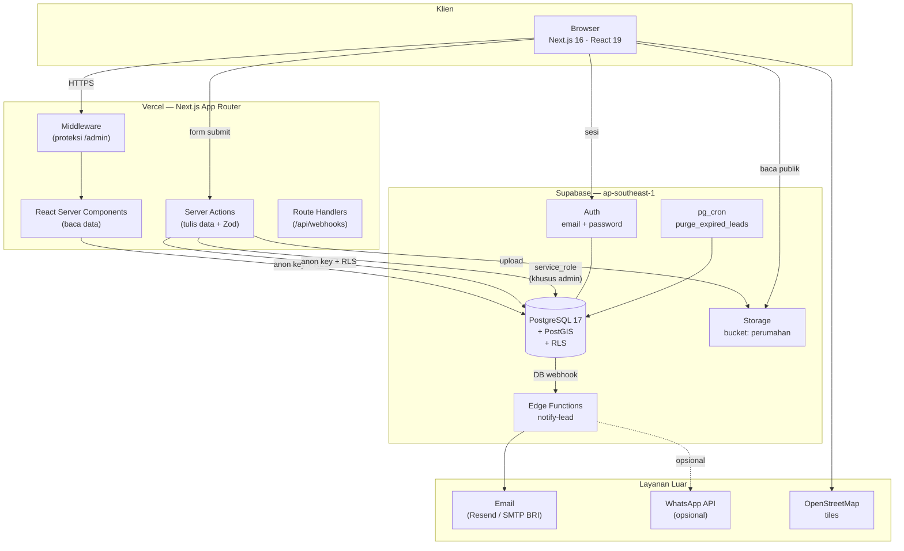
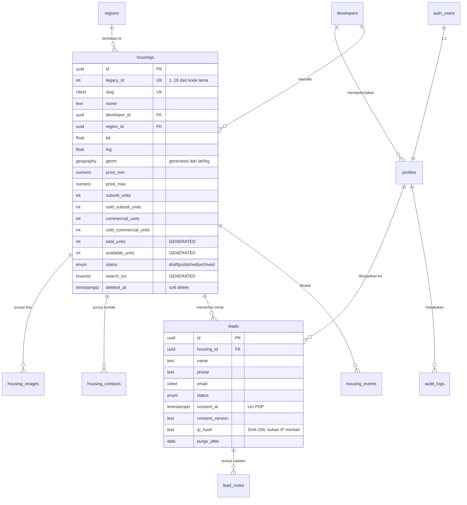
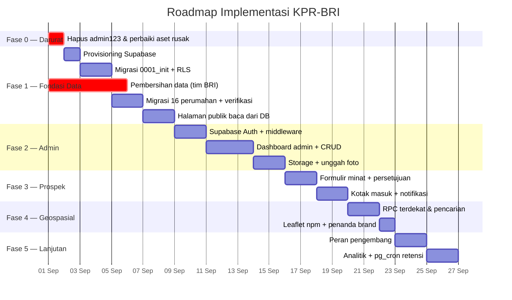

# PRD — Platform KPR Bersubsidi BRI Pematang Siantar

**Produk:** Platform pencarian perumahan bersubsidi dengan peta interaktif
**Repositori:** `~/Documents/BRI-App/KPR-BRI`
**Dokumen pendamping:** `design.md` (sistem desain & frontend) — dokumen ini melengkapinya dari sisi arsitektur, database, dan backend
**Versi:** 1.0 · 28 Agustus 2026
**Status:** Draft untuk direview
**Bahasa:** Indonesia (istilah teknis, SQL, dan kode tetap dalam bahasa Inggris)

---

## 1. Ringkasan Eksekutif

Aplikasi KPR-BRI saat ini adalah **prototipe frontend yang berfungsi baik tetapi tidak memiliki backend**. Seluruh 16 data perumahan ditulis keras (*hardcoded*) di dalam `src/lib/housing-storage.ts`, disimpan di `localStorage` browser masing-masing pengunjung, dan otentikasi admin berupa satu kata sandi tetap `admin123` yang tercetak di layar login.

Konsekuensinya nyata dan langsung:

- Perubahan data yang dilakukan admin **hanya tersimpan di perangkat admin itu sendiri** — pengunjung lain tidak pernah melihatnya.
- Tidak ada satu pun sumber kebenaran (*single source of truth*). Ketersediaan unit, harga, dan kontak tidak dapat diperbarui secara operasional.
- Siapa pun yang membuka *DevTools* dapat menulis ulang seluruh basis data perumahan.
- Tidak ada jejak audit, tidak ada cadangan, tidak ada mekanisme menangkap calon pembeli.

PRD ini menetapkan pemindahan platform ke **Supabase** (PostgreSQL 17 + PostGIS, Auth, Storage, Edge Functions) dengan Next.js 16 sebagai lapisan aplikasi. Sasarannya bukan menambah fitur mewah, melainkan **menjadikan produk ini layak dioperasikan**: data yang benar, akses yang terkendali, jejak yang terekam, dan calon pembeli yang tertangkap.

Seluruh skema pada Lampiran A **telah divalidasi** dengan menjalankannya di PostgreSQL 16.13 + PostGIS 3.4 — termasuk uji RLS, uji *rate limit*, dan uji trigger audit. Hasil pengujian dilampirkan pada §17.3.

---

## 2. Latar Belakang & Temuan Audit

### 2.1 Kondisi teknis saat ini

| Aspek | Kondisi |
|---|---|
| Penyimpanan data | `localStorage` browser, seed 16 baris di `housing-storage.ts` |
| Otentikasi | `lib/admin-auth.ts` — perbandingan string `password === "admin123"`, status disimpan sebagai `localStorage.adminLogged = "true"` |
| Dashboard admin | **Tidak ada.** `app/admin/page.tsx` dan `app/admin/login/page.tsx` berisi komponen login yang identik |
| CRUD | `saveHousingData()` dan `resetHousingData()` diekspor tetapi **tidak pernah dipanggil** dari UI mana pun |
| Gambar | File statis di `public/kpr-assets/`, tidak dapat diunggah lewat aplikasi |
| Pencarian terdekat | Haversine di sisi klien atas seluruh baris (`lib/geolocation-utils.ts`) |
| Peta | Leaflet di-*inject* dari CDN saat runtime; ikon penanda diambil dari `raw.githubusercontent.com` |
| Lead / prospek | Tidak ada. Nomor telepon di footer adalah satu-satunya jalur kontak |
| Audit & backup | Tidak ada |

### 2.2 Temuan kritis (harus ditangani)

| # | Temuan | Dampak | Bukti |
|---|---|---|---|
| **K-1** | Kata sandi admin `admin123` ditulis keras dan **ditampilkan di halaman login** sebagai petunjuk demo | Siapa pun dapat masuk sebagai admin | `lib/admin-auth.ts:2`, `admin/login/page.tsx` |
| **K-2** | Otorisasi hanya `localStorage.adminLogged === "true"` | Dapat dipalsukan dari konsol browser dalam satu baris | `lib/admin-auth.ts` |
| **K-3** | `/admin` dan `/admin/login` merender komponen yang sama; login sukses `router.push("/admin")` → kembali ke halaman login | Dashboard tidak pernah dapat diakses | kedua berkas identik |
| **K-4** | **15 dari 16 perumahan menampilkan "0% Tersedia" dan status "Rendah" (merah)** karena `subsidiUnits` dan `commercialUnits` kosong, sehingga pembagi = 0 | Layar utama produk menampilkan informasi yang salah kepada calon pembeli | perhitungan di `housing-popup.tsx:36–38` |
| **K-5** | Perumahan id 1 menampilkan **"562% Tersedia"** (`availableUnits` 45 ÷ `subsidiUnits` 8) | Angka mustahil, merusak kredibilitas | data seed |
| **K-6** | `availableUnits` disimpan terpisah dari `subsidiUnits`/`soldSubsidiUnits`, tanpa relasi yang dijamin | Sumber utama K-4 dan K-5 | `Housing` interface |
| **K-7** | Perumahan **id 9, 15, dan 16 memiliki koordinat identik** (3.011792, 99.096234) | Tiga penanda menumpuk di satu titik peta | data seed |
| **K-8** | Kontak: `contactPerson` "Ali Atin" pada seluruh 16 baris; email jelas placeholder (`greenvalley.com`, `majujaya.com`, `bukitsejahtera.com`, `harmonisent.com`) | Calon pembeli menghubungi alamat yang tidak ada | data seed |
| **K-9** | `roofType`/`wallType` terisi 1 dari 16; `foundationType` 0 dari 16 | Popup menampilkan "Tidak ada data" pada 15 perumahan | data seed |
| **K-10** | `priceRange` identik `"Rp 166.000.000"` pada seluruh 16 baris, tersimpan sebagai **string**, bukan angka | Tidak dapat difilter, diurutkan, atau dihitung | data seed |
| **K-11** | `/luxury-residence.jpg` dan `/placeholder.svg` dirujuk tetapi **tidak ada di `public/`** | Gambar rusak; *fallback* untuk gambar hilang justru ikut hilang | `housing-storage.ts`, `image-slideshow.tsx:23` |
| **K-12** | Geolokasi diminta otomatis saat `/map` dimuat, tanpa penjelasan | Izin ditolak pengguna; juga masalah kepercayaan | `map/page.tsx:29` |

Temuan K-4 sampai K-10 menegaskan poin utama PRD ini: **masalahnya bukan tampilan, melainkan tidak adanya model data yang menegakkan kebenarannya sendiri.** Skema pada §7 memindahkan `available_units` menjadi kolom terhitung (*generated column*) sehingga K-4, K-5, dan K-6 tidak mungkin terjadi lagi — bukan karena disiplin, melainkan karena database menolaknya.

---

## 3. Sasaran, Non-Sasaran, dan Metrik

### 3.1 Sasaran

1. **Satu sumber kebenaran.** Seluruh data perumahan berada di PostgreSQL terkelola, bukan di browser.
2. **Otentikasi yang benar.** Supabase Auth menggantikan kata sandi tetap; tidak ada pendaftaran publik.
3. **Otorisasi berlapis.** RLS di database ditambah GRANT tingkat tabel, sehingga kebocoran satu lapis tidak membuka data.
4. **Dashboard admin yang berfungsi.** CRUD perumahan, unggah foto, kelola kontak, kelola prospek.
5. **Menangkap calon pembeli.** Formulir minat per perumahan dengan persetujuan yang tercatat.
6. **Pencarian geospasial di server.** PostGIS menggantikan Haversine sisi klien.
7. **Jejak audit.** Setiap perubahan pada perumahan, pengembang, dan prospek terekam.
8. **Kepatuhan data pribadi.** Penanganan data prospek sesuai UU No. 27 Tahun 2022.

### 3.2 Non-sasaran (fase ini)

- Integrasi langsung ke sistem inti (*core banking*) BRI atau proses persetujuan KPR.
- Pengajuan KPR resmi secara daring. Platform ini menangkap **minat**, bukan aplikasi kredit.
- Pembayaran, tanda tangan digital, verifikasi KTP/Dukcapil.
- Aplikasi mobile *native*.
- Cakupan wilayah di luar Kota Pematangsiantar (skema sudah menyiapkan `regions`, tetapi data belum).

### 3.3 Metrik keberhasilan

| Metrik | Baseline | Target |
|---|---|---|
| Perumahan dengan `availability_percent` valid (0–100%) | 1 dari 16 (6%) | **16 dari 16 (100%)** |
| Perumahan dengan kontak terverifikasi | 0 | 16 |
| Waktu admin memperbarui satu data perumahan | Tidak mungkin | < 2 menit |
| Perubahan data yang terlihat oleh semua pengunjung | 0% | 100% |
| Prospek tertangkap per bulan | 0 (tidak ada mekanisme) | Terukur, baseline dibentuk di bulan pertama |
| P95 waktu respons RPC `nearest_housings` | — | < 150 ms |
| Kredensial admin yang dapat ditebak dari kode sumber | Ya | **Tidak** |

---

## 4. Persona dan User Story

### 4.1 Persona

| Persona | Deskripsi | Akses |
|---|---|---|
| **Pengunjung** (anon) | Calon pembeli rumah subsidi di Pematang Siantar. Mayoritas membuka dari ponsel dengan koneksi seluler. | Baca perumahan berstatus `published`, kirim minat |
| **Admin BRI** | Petugas yang memelihara seluruh data perumahan dan menindaklanjuti prospek. Fase 1: **satu operator**. | Penuh |
| **Pengembang** | Pengelola perumahan yang kelak memelihara datanya sendiri. **Belum aktif di Fase 1**, tetapi skema dan RLS sudah menyiapkannya. | Terbatas pada perumahan miliknya |

> **Catatan keputusan.** Ruang lingkup yang disetujui adalah *full platform*, sedangkan peran yang disetujui adalah *single admin*. Keduanya didamaikan sebagai berikut: **skema, RLS, dan tabel kepemilikan dibangun multi-peran sejak awal** (kolom `developer_id`, enum `user_role`, kebijakan per baris — semuanya sudah teruji), tetapi **Fase 1 hanya menerbitkan satu akun `admin`**. Menambah pengembang kelak adalah pekerjaan menyisipkan baris, bukan migrasi skema.

### 4.2 User story utama

**Pengunjung**

- Sebagai pengunjung, saya ingin melihat perumahan bersubsidi di peta agar tahu mana yang dekat dengan tempat kerja saya.
- Sebagai pengunjung, saya ingin menekan satu tombol untuk menemukan perumahan terdekat dari posisi saya, **setelah dijelaskan lebih dahulu untuk apa lokasi saya dipakai**.
- Sebagai pengunjung, saya ingin melihat berapa unit yang masih tersedia agar tidak menghubungi perumahan yang sudah habis.
- Sebagai pengunjung, saya ingin meninggalkan nama dan nomor telepon pada perumahan yang saya minati agar dihubungi.

**Admin BRI**

- Sebagai admin, saya ingin masuk dengan akun pribadi yang kata sandinya tidak ada di dalam kode.
- Sebagai admin, saya ingin menambah, mengubah, dan mengarsipkan perumahan, dan perubahan itu langsung terlihat oleh publik.
- Sebagai admin, saya ingin mengunggah foto perumahan tanpa menyentuh repositori.
- Sebagai admin, saya ingin menyimpan perumahan sebagai `draft` sampai datanya lengkap.
- Sebagai admin, saya ingin melihat daftar prospek masuk beserta perumahan yang diminati, dan menandai mana yang sudah dihubungi.
- Sebagai admin, saya ingin melihat siapa mengubah apa dan kapan.

**Pengembang (Fase 3)**

- Sebagai pengembang, saya ingin memperbarui ketersediaan unit perumahan saya sendiri, dan tidak bisa melihat atau mengubah milik pengembang lain.

---

## 5. Ruang Lingkup per Fase

| Fase | Nama | Isi | Estimasi |
|---|---|---|---|
| **0** | Perbaikan darurat | Hapus `admin-auth.ts` & petunjuk `admin123`; perbaiki dua rujukan gambar rusak (K-11); nonaktifkan geolokasi otomatis (K-12) | 0,5 hari |
| **1** | Fondasi data | Provisioning Supabase, migrasi `0001_init`, RLS, pembersihan & migrasi 16 baris data, klien Supabase di Next.js, halaman publik membaca dari database | 4–6 hari |
| **2** | Admin & autentikasi | Supabase Auth, middleware, dashboard admin, CRUD perumahan, unggah foto ke Storage, kelola kontak | 5–7 hari |
| **3** | Prospek & notifikasi | Formulir minat + persetujuan, RPC `submit_lead`, kotak masuk prospek, Edge Function notifikasi, *outbox* | 3–5 hari |
| **4** | Geospasial & pencarian | RPC `nearest_housings` & `search_housings`, filter kecamatan, Leaflet dari npm dengan penanda brand | 2–3 hari |
| **5** | Multi-peran & analitik | Peran `pengembang` diaktifkan, `housing_events`, dashboard ringkas, `pg_cron` untuk retensi | 3–4 hari |

Setiap fase harus dapat dirilis sendiri. Fase 0 dikerjakan hari ini juga, terlepas dari kapan sisanya dimulai.

---

## 6. Arsitektur Sistem

### 6.1 Gambaran umum



### 6.2 Keputusan arsitektur

| # | Keputusan | Alasan | Alternatif yang ditolak |
|---|---|---|---|
| **A-1** | **Supabase** sebagai backend | Postgres terkelola + Auth + Storage + RLS dalam satu produk; region `ap-southeast-1` (Singapura) adalah yang terdekat untuk Sumatera Utara; tim tidak perlu mengelola server | Firebase (tanpa SQL, geospasial lemah); backend Node sendiri (beban operasional) |
| **A-2** | **Proyek Supabase baru khusus**, bukan menumpang "Sanz LAB" | Produk keuangan tidak boleh berbagi basis data dengan proyek eksperimen; kuota, backup, dan kunci API harus terpisah | Skema `kpr` di proyek yang ada |
| **A-3** | **RLS sebagai lapisan otorisasi utama**, ditambah GRANT per tabel | Aturan akses berlaku walau ada bug di lapisan aplikasi. Pengujian §17.3 membuktikan `anon` ditolak di dua lapis sekaligus | Otorisasi hanya di sisi aplikasi |
| **A-4** | **Server Actions** untuk tulis; **RSC** untuk baca | Sudah bawaan Next.js 16; tidak perlu lapisan REST tambahan; validasi Zod di batas server | REST API terpisah; tRPC |
| **A-5** | **`service_role` hanya di Server Action admin**, tidak pernah di klien | Kunci ini melewati RLS. Satu kebocoran = akses penuh | Memakai `service_role` demi kemudahan |
| **A-6** | **PostGIS `geography(Point,4326)`** sebagai kolom terhitung dari `lat`/`lng` | Indeks GiST + operator KNN `<->` membuat "terdekat" berjalan di database; `lat`/`lng` tetap ada untuk Leaflet | Menyimpan hanya `lat`/`lng` dan menghitung di klien |
| **A-7** | **`available_units` sebagai generated column** | Menutup K-4, K-5, K-6 secara struktural | Kolom biasa + disiplin aplikasi |
| **A-8** | **`submit_lead` sebagai RPC `SECURITY DEFINER`**; tidak ada policy INSERT untuk `anon` | Publik dapat mengirim prospek tanpa pernah memiliki hak tulis ke tabel `leads`. Validasi dan *rate limit* berada di dalam fungsi | Policy INSERT untuk `anon` (membuka penyalahgunaan) |
| **A-9** | **Pola outbox** untuk notifikasi | Kegagalan kirim email tidak menggagalkan transaksi prospek; percobaan ulang terkendali | Memanggil layanan email langsung di dalam transaksi |
| **A-10** | **Soft delete** (`deleted_at`) pada `housings` | Data perumahan punya nilai historis; penghapusan tak sengaja dapat dipulihkan | `DELETE` permanen |
| **A-11** | **Leaflet dari npm**, bukan CDN runtime | Menghilangkan dua permintaan pihak ketiga yang memblokir render, plus ketergantungan pada `raw.githubusercontent.com` | Status quo |

### 6.3 Lingkungan

| Lingkungan | Supabase | Next.js | Data |
|---|---|---|---|
| `local` | Supabase CLI (`supabase start`, Docker) | `next dev` | Seed dari `supabase/seed.sql` |
| `staging` | Proyek `kpr-bri-staging` | Vercel Preview | Salinan anonim data produksi |
| `production` | Proyek `kpr-bri` (ap-southeast-1) | Vercel Production | Data sebenarnya |

Migrasi dikelola sebagai berkas di `supabase/migrations/` dan masuk ke Git. **Tidak ada perubahan skema langsung lewat Studio di produksi.**

---

## 7. Model Data

### 7.1 ERD



### 7.2 Daftar tabel

| Tabel | Fungsi | Baca publik? |
|---|---|---|
| `profiles` | Profil pengguna, 1:1 dengan `auth.users`, memegang `role` | Tidak |
| `developers` | Pengembang perumahan | Ya (yang aktif) |
| `regions` | Referensi kecamatan/kelurahan Pematangsiantar | Ya |
| `housings` | **Tabel inti.** Menggantikan `getInitialHousingData()` | Ya (yang `published`) |
| `housing_images` | Foto per perumahan, menunjuk ke Storage | Ya (induk `published`) |
| `housing_contacts` | Kontak pemasaran per perumahan | Ya (induk `published`) |
| `leads` | Minat calon pembeli — **berisi data pribadi** | **Tidak** |
| `lead_notes` | Catatan tindak lanjut per prospek | Tidak |
| `audit_logs` | Jejak perubahan | Tidak (admin saja) |
| `housing_events` | Analitik tanpa PII | Tulis saja bagi publik |
| `app_settings` | Konfigurasi runtime (`public.*` boleh dibaca) | Sebagian |
| `notification_outbox` | Antrean notifikasi | Tidak (service_role saja) |

DDL lengkap yang sudah divalidasi ada di **Lampiran A**.

### 7.3 Keputusan pemodelan penting

**Ketersediaan unit — inti perbaikan K-4/K-5/K-6**

```sql
total_units     integer generated always as (subsidi_units + commercial_units) stored,
available_units integer generated always as
                  ((subsidi_units + commercial_units)
                   - (sold_subsidi_units + sold_commercial_units)) stored,

constraint housings_units_ck check (
  subsidi_units >= 0 and commercial_units >= 0 and
  sold_subsidi_units    between 0 and subsidi_units and
  sold_commercial_units between 0 and commercial_units
)
```

`available_units` tidak lagi dapat diisi manusia. `availability_percent` dihitung di view sebagai `available_units × 100 / total_units`, dengan `null` bila `total_units = 0` — sehingga UI menampilkan "Data belum lengkap", bukan "0% Tersedia" yang menyesatkan. Angka 562% menjadi tidak mungkin secara matematis.

**Harga sebagai angka, bukan string**

`priceRange: "Rp 166.000.000"` menjadi `price_min numeric(14,2)` dan `price_max numeric(14,2)`. Pemformatan Rupiah adalah urusan presentasi (`Intl.NumberFormat("id-ID")`), bukan penyimpanan. Ini membuka filter harga, pengurutan, dan simulasi angsuran.

**Koordinat**

`lat`/`lng` tetap sebagai `double precision` (dipakai langsung oleh Leaflet), dan `geom` dihasilkan otomatis untuk PostGIS. Batas `check` menjaga koordinat berada dalam wilayah Indonesia — sebuah salah ketik seperti `99.065307, 2.997136` (terbalik) akan ditolak database.

**`legacy_id`**

Kolom unik menyimpan id 1–16 dari `housing-storage.ts` agar migrasi dapat diverifikasi baris demi baris dan dapat diulang (*idempotent*).

**Soft delete**

`deleted_at` pada `housings`. Semua policy dan view menyaring `deleted_at is null`.

---

## 8. Kualitas dan Migrasi Data

Migrasi bukan sekadar memindahkan 16 baris; **data saat ini tidak lolos batasan skema baru**, dan itu memang tujuannya.

### 8.1 Pekerjaan pembersihan yang wajib dilakukan lebih dahulu

| # | Masalah | Tindakan | Penanggung jawab |
|---|---|---|---|
| D-1 | 15 dari 16 baris tidak punya `subsidiUnits`/`commercialUnits` (K-4) | Isi jumlah unit sebenarnya per perumahan. Bila belum diketahui, isi `subsidi_units = availableUnits + sold_subsidi_units` sebagai perkiraan sementara **dan tandai `status = 'draft'`** | Tim data BRI |
| D-2 | id 1: `availableUnits` 45 > `subsidiUnits` 8 (K-5) | Konfirmasi angka sebenarnya. Nilai lama ditolak oleh `housings_units_ck` | Tim data BRI |
| D-3 | id 9, 15, 16 berkoordinat identik (K-7) | Ambil koordinat sebenarnya. Ditandai oleh *query* verifikasi §8.3 | Tim data BRI |
| D-4 | Kontak placeholder (K-8) | Isi `housing_contacts` dengan nama, telepon, dan email pemasaran yang benar | Tim data BRI |
| D-5 | Spesifikasi teknis nyaris kosong (K-9) | Isi `roof_type`, `wall_type`, `foundation_type`, `building_area`, `land_area`, `bedrooms`, `bathrooms` | Tim data BRI |
| D-6 | Harga seragam (K-10) | Konfirmasi apakah Rp 166.000.000 memang batas subsidi seragam. Bila ya, cukup dinyatakan sekali di teks bagian, tidak diulang 16 kali | Tim produk |
| D-7 | Alamat bercampur (jalan + kecamatan + kelurahan dalam satu string) | Pecah: `address` untuk jalan, `region_id` untuk kecamatan/kelurahan | Skrip + verifikasi manual |

> **Aturan keras:** perumahan yang belum lolos D-1 sampai D-5 **tidak boleh berstatus `published`**. Batasan `housings_published_ck` sudah menegakkan sebagian (wajib `published_at` dan `price_min`); sisanya ditegakkan lewat daftar periksa admin.

### 8.2 Prosedur migrasi

1. Ekstrak 16 baris dari `getInitialHousingData()` menjadi CSV (skrip sekali pakai).
2. Tim data melengkapi CSV sesuai §8.1 di spreadsheet.
3. Impor ke tabel *staging* `_import_housings` di Supabase.
4. Jalankan `0002_seed_from_legacy.sql`: sisipkan `regions` unik, `developers`, `housings` (dengan `legacy_id`), `housing_contacts`, `housing_images`.
5. Unggah 15 berkas `public/kpr-assets/` ke bucket `perumahan` dengan pola `perumahan/{housing_id}/{uuid}.webp`; catat ke `housing_images`.
6. Jalankan *query* verifikasi (§8.3).
7. Naikkan `status = 'published'` hanya untuk baris yang lolos.
8. Hapus `_import_housings`.

`housing-storage.ts` tetap disimpan di repositori sebagai referensi selama satu siklus rilis, lalu dihapus.

### 8.3 Query verifikasi (jalankan setelah migrasi)

```sql
-- 1. Semua 16 baris terbawa?
select count(*) = 16 as jumlah_benar from public.housings where legacy_id is not null;

-- 2. Adakah persentase ketersediaan yang mustahil? (harus 0 baris)
select legacy_id, name, available_units, total_units
from public.housings
where total_units > 0 and (available_units > total_units or available_units < 0);

-- 3. Adakah koordinat kembar? (harus 0 baris setelah D-3)
select array_agg(legacy_id) as ids, lat, lng
from public.housings group by lat, lng having count(*) > 1;

-- 4. Adakah published tanpa data wajib? (harus 0 baris)
select legacy_id, name from public.housings
where status = 'published'
  and (total_units = 0 or price_min is null
       or not exists (select 1 from public.housing_contacts c where c.housing_id = housings.id)
       or not exists (select 1 from public.housing_images  i where i.housing_id = housings.id and i.is_cover));

-- 5. Adakah email placeholder tersisa? (harus 0 baris)
select id, name, email from public.housing_contacts
where email::text ~* '(greenvalley|majujaya|bukitsejahtera|harmonisent|sinarindah)\.com';

-- 6. Semua perumahan punya foto sampul?
select h.legacy_id, h.name from public.housings h
where not exists (select 1 from public.housing_images i where i.housing_id = h.id and i.is_cover);
```

Keenam *query* ini menjadi bagian dari Definition of Done Fase 1.

---

## 9. Keamanan

### 9.1 Autentikasi

| Aspek | Ketentuan |
|---|---|
| Penyedia | Supabase Auth, email + kata sandi |
| Pendaftaran publik | **Dinonaktifkan.** Akun dibuat lewat undangan dari Dashboard Supabase |
| Panjang kata sandi | Minimal 12 karakter; aktifkan pemeriksaan kata sandi bocor (*leaked password protection*) |
| MFA | Aktifkan TOTP untuk seluruh akun `admin` — ini produk keuangan |
| Sesi | Cookie `httpOnly` `secure` `sameSite=lax` via `@supabase/ssr`; JWT umur pendek + refresh token bergilir |
| Middleware | `middleware.ts` mencegat `/admin/:path*`, menyegarkan sesi, mengalihkan tamu ke `/admin/login` |
| Profil otomatis | Trigger pada `auth.users` membuat baris `profiles` dengan `role = 'viewer'`. Kenaikan ke `admin` dilakukan manual — **tidak pernah otomatis** |

**Wajib dihapus pada Fase 0:**

```
src/lib/admin-auth.ts                          ← seluruh berkas
src/app/admin/login/page.tsx  baris petunjuk   ← "Untuk demo: gunakan password admin123"
src/app/admin/page.tsx                         ← ganti dengan dashboard sesungguhnya
```

### 9.2 Otorisasi — dua lapis

**Lapis 1 — GRANT tingkat tabel.** Peran `anon` tidak diberi hak apa pun atas `leads`, `audit_logs`, atau `notification_outbox`. Percobaan akses ditolak sebelum RLS dievaluasi.

**Lapis 2 — Row Level Security.** RLS aktif di **seluruh dua belas tabel**. Ringkasan kebijakan:

| Tabel | anon | pengembang | admin |
|---|---|---|---|
| `housings` | SELECT (`published`) | SELECT/INSERT/UPDATE miliknya | Penuh |
| `housing_images`, `housing_contacts` | SELECT (induk `published`) | Penuh untuk perumahan miliknya | Penuh |
| `developers`, `regions` | SELECT | SELECT | Penuh |
| `leads` | **Tidak ada akses.** Menulis hanya lewat RPC | SELECT/UPDATE untuk perumahan miliknya | Penuh |
| `lead_notes` | — | Untuk prospek miliknya | Penuh |
| `audit_logs` | — | — | SELECT saja |
| `housing_events` | INSERT | — | SELECT |
| `app_settings` | SELECT (`key like 'public.%'`) | idem | Penuh |
| `notification_outbox` | — | — | — (`service_role` saja) |
| `profiles` | — | Baris sendiri | Penuh |

Fungsi pembantu `is_admin()` dan `my_developer_id()` bersifat `SECURITY DEFINER` `STABLE` dengan `search_path` terkunci, sehingga kebijakan tetap ringkas dan tidak rentan pembajakan `search_path`.

### 9.3 Kunci API

| Kunci | Tempat | Catatan |
|---|---|---|
| `NEXT_PUBLIC_SUPABASE_URL` | Klien + server | Publik |
| `NEXT_PUBLIC_SUPABASE_ANON_KEY` | Klien + server | Publik **karena** RLS aktif. Tanpa RLS, kunci ini setara akses penuh |
| `SUPABASE_SERVICE_ROLE_KEY` | **Server saja** | Melewati RLS. Jangan pernah diberi awalan `NEXT_PUBLIC_`. Hanya dipakai di Server Action admin dan Edge Function |

`.gitignore` proyek sudah mengabaikan `.env*` — pertahankan.

### 9.4 Pengerasan lain

- **Rate limit** pada `submit_lead`: maksimal 3 pengajuan per `ip_hash` per jam, ditegakkan **di dalam fungsi database** (teruji, §17.3). Ditambah Cloudflare Turnstile di frontend.
- **Validasi masukan** dengan Zod di batas Server Action, dan `CHECK` constraint di database. Nomor telepon divalidasi pola `^[0-9+][0-9 ()+-]{7,19}$`.
- **IP tidak disimpan mentah.** Hanya `sha256(ip + salt_rahasia)`, cukup untuk rate limit tetapi bukan pengenal langsung.
- **CSP** di `next.config.ts`: batasi `img-src` ke domain Supabase Storage dan tile OSM; `script-src 'self'`.
- **Storage**: bucket `perumahan` publik untuk baca, tulis hanya untuk pengguna terotentikasi; batas 5 MB per berkas; MIME dibatasi `image/jpeg`, `image/png`, `image/webp`, `image/avif`.

---

## 10. Backend dan Kontrak API

### 10.1 Pembagian tanggung jawab

| Lapisan | Dipakai untuk | Kunci |
|---|---|---|
| **React Server Component** | Semua pembacaan halaman publik dan admin | `anon` + sesi pengguna, RLS berlaku |
| **Server Action** | Semua penulisan dari UI (CRUD, unggah, ubah status prospek) | `anon` + sesi; `service_role` hanya untuk operasi admin tertentu |
| **RPC (Postgres function)** | Logika yang harus dekat data: `nearest_housings`, `search_housings`, `submit_lead` | Sesuai definisi fungsi |
| **Route Handler** | Hanya webhook masuk (`/api/webhooks/*`) dan `robots.txt`/`sitemap.xml` | Verifikasi tanda tangan |
| **Edge Function** | Kerja asinkron di luar siklus permintaan: kirim notifikasi | `service_role` |

Tidak ada REST API terpisah. Aplikasi ini punya satu konsumen — dirinya sendiri.

### 10.2 Kontrak baca (RSC)

```ts
// src/lib/queries/housings.ts
export async function getPublishedHousings() {
  const supabase = await createServerClient()
  const { data, error } = await supabase
    .from('v_housing_public')
    .select('*')
    .order('name')
  if (error) throw error
  return data
}

export async function getHousingBySlug(slug: string) { /* .eq('slug', slug).maybeSingle() */ }
export async function getNearest(lat: number, lng: number, limit = 5) {
  return supabase.rpc('nearest_housings', { p_lat: lat, p_lng: lng, p_limit: limit })
}
```

Halaman publik memakai `export const revalidate = 300` (ISR 5 menit) dan `revalidateTag('housings')` dipanggil setiap kali admin menyimpan — sehingga perubahan tampil segera tanpa mematikan cache.

### 10.3 Kontrak tulis (Server Action)

Semua aksi mengikuti pola yang sama: validasi Zod → periksa otorisasi → operasi database → tulis audit (otomatis lewat trigger) → `revalidateTag`.

```ts
// src/app/admin/perumahan/actions.ts
'use server'

const HousingSchema = z.object({
  name:                  z.string().min(3).max(160),
  slug:                  z.string().regex(/^[a-z0-9-]+$/).max(80),
  developer_id:          z.string().uuid().nullable(),
  region_id:             z.string().uuid().nullable(),
  address:               z.string().max(400),
  lat:                   z.number().min(-11).max(6),
  lng:                   z.number().min(95).max(141),
  price_min:             z.number().int().positive().nullable(),
  price_max:             z.number().int().positive().nullable(),
  subsidi_units:         z.number().int().min(0),
  sold_subsidi_units:    z.number().int().min(0),
  commercial_units:      z.number().int().min(0),
  sold_commercial_units: z.number().int().min(0),
  status:                z.enum(['draft', 'published', 'archived']),
}).refine(v => v.sold_subsidi_units <= v.subsidi_units,
          { message: 'Unit subsidi terjual melebihi total unit subsidi' })
 .refine(v => v.sold_commercial_units <= v.commercial_units,
          { message: 'Unit komersial terjual melebihi total unit komersial' })
 .refine(v => v.price_max === null || v.price_min === null || v.price_max >= v.price_min,
          { message: 'Harga maksimum tidak boleh lebih kecil dari harga minimum' })
```

| Aksi | Tanda tangan | Otorisasi |
|---|---|---|
| `createHousing` | `(FormData) → { id } \| { error }` | admin atau pengembang (miliknya) |
| `updateHousing` | `(id, FormData) → ...` | idem |
| `publishHousing` | `(id) → ...` | admin. Menolak bila `total_units = 0`, `price_min` null, atau tanpa foto sampul |
| `archiveHousing` | `(id) → ...` | admin |
| `softDeleteHousing` | `(id) → ...` | admin |
| `uploadHousingImage` | `(housingId, File) → { path }` | admin/pemilik. Validasi MIME + ukuran; konversi ke WebP sebelum unggah |
| `setCoverImage` | `(housingId, imageId) → ...` | admin/pemilik |
| `upsertContact` | `(housingId, data) → ...` | admin/pemilik |
| `updateLeadStatus` | `(leadId, status) → ...` | admin/pemilik |
| `addLeadNote` | `(leadId, body) → ...` | admin/pemilik |

Pesan galat dikembalikan **dalam bahasa Indonesia** dan tidak pernah membocorkan detail internal database.

### 10.4 RPC publik

**`nearest_housings(p_lat, p_lng, p_limit, p_max_km)`**
Menggantikan Haversine sisi klien. Memakai `ST_DWithin` untuk penyaringan berindeks dan operator KNN `<->` untuk pengurutan. Hanya mengembalikan yang `published`. `p_limit` dibatasi 50.

**`search_housings(p_q, p_district, p_min_price, p_max_price, p_limit, p_offset)`**
Pencarian teks penuh atas `search_tsv` dengan cadangan `ilike`, plus filter kecamatan dan rentang harga.

**`submit_lead(...) → uuid`**
`SECURITY DEFINER`. Memvalidasi perumahan `published`, menegakkan rate limit, menyisipkan prospek dengan jejak persetujuan, lalu mengantre notifikasi ke *outbox*. Ini **satu-satunya** jalur tulis publik di seluruh sistem.

### 10.5 Struktur berkas yang diusulkan

```
src/
├─ app/
│  ├─ (public)/
│  │  ├─ page.tsx                    # landing (RSC, baca DB)
│  │  ├─ perumahan/[slug]/page.tsx   # halaman detail  [BARU]
│  │  └─ map/page.tsx
│  ├─ admin/
│  │  ├─ layout.tsx                  # cek sesi + shell
│  │  ├─ page.tsx                    # DASHBOARD (menggantikan duplikat login)
│  │  ├─ login/page.tsx
│  │  ├─ perumahan/{page,baru,[id]}
│  │  ├─ prospek/page.tsx
│  │  └─ pengaturan/page.tsx
│  └─ api/webhooks/[...]/route.ts
├─ lib/
│  ├─ supabase/{client,server,middleware}.ts
│  ├─ queries/{housings,leads,stats}.ts
│  ├─ schemas/{housing,lead,contact}.ts     # Zod
│  ├─ format.ts                             # Intl id-ID: rupiah, jarak, tanggal
│  └─ geolocation-utils.ts                  # dipertahankan sebagai cadangan offline
supabase/
├─ migrations/
│  ├─ 0001_init.sql
│  ├─ 0002_seed_from_legacy.sql
│  └─ 0003_storage_policies.sql
├─ functions/notify-lead/index.ts
└─ seed.sql
```

---

## 11. Storage

**Bucket `perumahan`** — publik untuk baca, tulis hanya bagi pengguna terotentikasi.

```
perumahan/{housing_id}/{uuid}.webp      # foto perumahan
developers/{developer_id}/logo.webp     # logo pengembang
```

Kebijakan Storage:

```sql
create policy "perumahan_read_public" on storage.objects
  for select to anon, authenticated using (bucket_id = 'perumahan');

create policy "perumahan_write_staff" on storage.objects
  for insert to authenticated
  with check (bucket_id = 'perumahan' and public.is_admin());

create policy "perumahan_delete_staff" on storage.objects
  for delete to authenticated
  using (bucket_id = 'perumahan' and public.is_admin());
```

Ketentuan unggah, selaras dengan §7 `design.md`:

- Konversi ke **WebP kualitas 72** dan potong ke rasio **4:3, master 1200×900** sebelum unggah.
- Maksimal 5 MB per berkas, 12 foto per perumahan.
- Simpan `width`, `height`, dan `bytes` ke `housing_images` agar `next/image` tidak menimbulkan pergeseran tata letak.
- Transformasi gambar Supabase dipakai untuk varian ukuran; `next.config.ts` menambahkan host Supabase ke `images.remotePatterns`.
- Aset lama di `public/kpr-assets/` **tetap ada di repositori** (sesuai batasan `design.md`) dan sekaligus disalin ke Storage. Setelah migrasi diverifikasi, aplikasi membaca dari Storage.

---

## 12. Notifikasi

Pola *outbox*, agar kegagalan pengiriman tidak pernah menggagalkan penyimpanan prospek.

1. `submit_lead` menyisipkan baris ke `notification_outbox` **di dalam transaksi yang sama** dengan prospeknya.
2. Database Webhook Supabase pada `INSERT notification_outbox` memanggil Edge Function `notify-lead`.
3. Edge Function mengirim email; sukses → `status='sent'`; gagal → `attempts++`, `next_try_at = now() + interval '5 minutes' * 2^attempts`, `status='failed'`.
4. `pg_cron` tiap 5 menit mengambil ulang antrean `failed` yang sudah waktunya; setelah 6 percobaan → `dead` dan memicu peringatan.

| Templat | Pemicu | Penerima | Isi |
|---|---|---|---|
| `lead_baru` | Prospek masuk | Email admin (`app_settings.admin_email`) | Nama, telepon, perumahan, waktu, tautan ke `/admin/prospek/{id}` |
| `lead_ringkasan_harian` | `pg_cron` 08.00 WIB | Email admin | Jumlah prospek baru 24 jam terakhir |
| `stok_menipis` | `available_units <= 5` | Email admin | Perumahan yang hampir habis |

WhatsApp (Fonnte / Twilio / WhatsApp Business API) disiapkan lewat enum `notif_channel` tetapi **belum diaktifkan** — pilihan penyedia dan biayanya adalah keputusan bisnis yang belum diambil.

> Notifikasi ke **calon pembeli** (bukan admin) hanya boleh dikirim bila persetujuan untuk dihubungi tercatat pada `leads.consent_at`. Lihat §13.

---

## 13. Perlindungan Data Pribadi (UU No. 27 Tahun 2022)

Tabel `leads` berisi nama, nomor telepon, dan email calon pembeli rumah bersubsidi — data pribadi dalam konteks produk keuangan. Ini bagian PRD dengan risiko tertinggi.

### 13.1 Ketentuan yang dibangun ke dalam sistem

| Prinsip | Penerapan |
|---|---|
| **Persetujuan eksplisit** | Formulir memakai *checkbox* yang tidak tercentang secara bawaan. `consent_at` dan `consent_version` wajib diisi (`not null`) — prospek tanpa jejak persetujuan tidak dapat disimpan |
| **Tujuan yang dinyatakan** | Teks persetujuan menyebutkan tujuan secara spesifik (lihat §13.2) dan versinya disimpan, sehingga perubahan teks dapat dilacak |
| **Minimalisasi data** | Hanya nama, telepon, email opsional, dan pesan. **Tidak ada** NIK, tanggal lahir, penghasilan, atau data keuangan |
| **Pembatasan akses** | `anon` tidak memiliki hak baca sama sekali; pengembang hanya melihat prospek untuk perumahannya |
| **Retensi** | `purge_after` bawaan 365 hari; `purge_expired_leads()` dijadwalkan `pg_cron` harian menghapus prospek `selesai`/`batal` yang kedaluwarsa |
| **Bukan pengenal langsung** | IP disimpan sebagai `sha256(ip + salt)`, hanya untuk rate limit |
| **Akuntabilitas** | Trigger audit mencatat setiap `UPDATE`/`DELETE` pada `leads` |
| **Hak subjek data** | Prosedur admin untuk mencari berdasarkan telepon/email, mengekspor, dan menghapus atas permintaan |

### 13.2 Teks persetujuan (versi `v1`)

> Saya bersedia dihubungi oleh petugas BRI atau pengembang perumahan terkait informasi KPR bersubsidi untuk perumahan yang saya pilih. Data saya (nama, nomor telepon, dan email) digunakan hanya untuk keperluan tersebut, tidak dibagikan kepada pihak lain, dan dapat saya minta hapus kapan saja melalui kontak yang tertera.

Setiap perubahan teks ini menaikkan `consent_version` ke `v2`, dan seterusnya. Prospek lama tetap membawa versi yang mereka setujui.

### 13.3 Batasan

Dokumen ini bukan nasihat hukum. Sebelum formulir prospek diaktifkan di produksi, **teks persetujuan, kebijakan privasi, dan periode retensi wajib ditinjau oleh tim hukum/kepatuhan BRI.** Halaman `/kebijakan-privasi` dan `/syarat-ketentuan` (tautan mati pada footer saat ini, lihat `design.md` §5.14) harus sudah terbit sebelum prospek pertama dikumpulkan.

---

## 14. Konfigurasi dan Deploy

### 14.1 Variabel lingkungan

| Variabel | Lingkup | Wajib | Keterangan |
|---|---|---|---|
| `NEXT_PUBLIC_SUPABASE_URL` | klien + server | ✅ | URL proyek |
| `NEXT_PUBLIC_SUPABASE_ANON_KEY` | klien + server | ✅ | Publik, dilindungi RLS |
| `SUPABASE_SERVICE_ROLE_KEY` | **server saja** | ✅ | Melewati RLS |
| `LEAD_IP_SALT` | server saja | ✅ | Garam untuk hash IP |
| `RESEND_API_KEY` | Edge Function | ✅ | Atau kredensial SMTP BRI |
| `ADMIN_NOTIFICATION_EMAIL` | Edge Function | ✅ | Penerima notifikasi |
| `TURNSTILE_SECRET_KEY` | server saja | ⬜ | Anti-bot formulir prospek |
| `NEXT_PUBLIC_TURNSTILE_SITE_KEY` | klien | ⬜ | — |
| `NEXT_PUBLIC_SITE_URL` | klien + server | ✅ | Untuk metadata & tautan email |

### 14.2 Pipeline

```
push ke feature branch
  └→ Vercel Preview + proyek Supabase staging
      └→ supabase db push (migrasi diterapkan ke staging)
          └→ smoke test + query verifikasi §8.3
              └→ merge ke main
                  └→ supabase db push (produksi) → Vercel Production
```

Migrasi hanya maju. Setiap migrasi disertai catatan *rollback* di komentar berkas.

### 14.3 Konfigurasi proyek Supabase

| Pengaturan | Nilai |
|---|---|
| Nama proyek | `kpr-bri` |
| Region | `ap-southeast-1` (Singapura) — terdekat ke Sumatera Utara |
| Postgres | 17 |
| Ekstensi | `postgis`, `pgcrypto`, `citext`, `pg_trgm`, `pg_cron`, `pg_net` |
| Pendaftaran publik | **Nonaktif** |
| Konfirmasi email | Aktif |
| Perlindungan kata sandi bocor | Aktif |
| PITR | Aktif (memerlukan paket berbayar) |

---

## 15. Observability dan Operasional

| Aspek | Ketentuan |
|---|---|
| **Backup** | Backup harian otomatis Supabase. **PITR wajib diaktifkan sebelum data produksi masuk** — ini produk keuangan, kehilangan data tidak dapat diterima. Uji pemulihan sekali per kuartal |
| **Monitoring** | Supabase Logs & Reports untuk kesehatan database; Vercel Analytics untuk web vitals; `@vercel/analytics` sudah terpasang |
| **Peringatan** | Kesalahan Edge Function; `notification_outbox` berstatus `dead`; koneksi database > 80%; error rate Vercel > 1% |
| **Advisor** | Jalankan Supabase Security & Performance Advisor setiap sebelum rilis. Nol temuan tingkat ERROR adalah syarat rilis |
| **Runbook** | Dokumen terpisah: pemulihan data, rotasi kunci API, promosi/pencabutan admin, penanganan permintaan hapus data |

---

## 16. Performa dan Biaya

### 16.1 Anggaran performa

| Metrik | Target |
|---|---|
| P95 `nearest_housings` | < 150 ms |
| P95 `search_housings` | < 200 ms |
| P95 daftar perumahan (RSC + ISR) | < 300 ms |
| LCP halaman utama (4G) | < 2,0 s |
| Ukuran halaman `/map` | < 600 KB |

Strategi: indeks GiST untuk geospasial, GIN untuk teks penuh, ISR 5 menit pada halaman publik dengan `revalidateTag` saat admin menyimpan, `next/image` + transformasi Supabase untuk gambar.

### 16.2 Catatan biaya

Beban kerja ini kecil: 16 baris data inti, foto beberapa ratus MB, lalu lintas regional. Paket gratis Supabase secara teknis mencukupi untuk Fase 1, **tetapi tidak untuk produksi** — paket berbayar diperlukan untuk PITR dan jaminan proyek tidak dijeda karena tidak aktif. Vercel Hobby cukup untuk staging; produksi sebaiknya di paket berbayar.

Harga kedua layanan berubah dari waktu ke waktu; **verifikasi tarif terkini sebelum menyusun anggaran.** Yang tetap benar adalah bentuk biayanya: dua langganan bulanan tetap yang kecil, tanpa lonjakan berbasis pemakaian pada skala ini.

---

## 17. Pengujian dan QA

### 17.1 Tingkatan pengujian

| Tingkat | Cakupan | Alat |
|---|---|---|
| Unit | Skema Zod, util format (rupiah, jarak, tanggal), Haversine | Vitest |
| Database | Kebijakan RLS per peran, batasan, generated column, RPC | pgTAP atau skrip SQL di CI |
| Integrasi | Server Action end-to-end terhadap Supabase lokal | Vitest + Supabase CLI |
| E2E | Alur admin (login → CRUD → publish), alur pengunjung (peta → detail → kirim minat) | Playwright |
| Aksesibilitas | Sesuai `design.md` §9 | axe-core |

### 17.2 Skenario keamanan wajib (harus gagal dengan benar)

1. `anon` membaca `leads` → **ditolak**
2. `anon` `INSERT` langsung ke `leads` → **ditolak** (harus lewat `submit_lead`)
3. `anon` `UPDATE` harga perumahan → **ditolak**
4. `anon` membaca perumahan berstatus `draft` → **tidak terlihat**
5. Pengembang A membaca perumahan `draft` milik pengembang B → **tidak terlihat**
6. Pengembang A membaca prospek milik pengembang B → **tidak terlihat**
7. Pengajuan ke-4 dari `ip_hash` yang sama dalam satu jam → **ditolak**
8. `submit_lead` ke perumahan `draft` → **ditolak**
9. `available_units` diisi manual → **ditolak** (generated column)
10. `sold_subsidi_units > subsidi_units` → **ditolak** (check constraint)
11. Kredensial `admin123` masih berfungsi → **harus gagal**

### 17.3 Hasil validasi skema (sudah dijalankan)

Skema Lampiran A dijalankan pada PostgreSQL 16.13 + PostGIS 3.4 dengan peran `anon`, `authenticated`, `service_role` yang meniru Supabase. Seluruh migrasi diterapkan tanpa galat. Hasil pengujian:

```
── Generated column: ketersediaan unit ──
 legacy_id  name                               subsidi  terjual  total  tersedia  persen
         1  Perumahan Innara Residence 2            50        5     50        45     90%
         2  Perumahan Mutiara Abadi Residence       90       12     90        78     87%
         3  MOGAKOVI PERMATA (draft)                40        8     40        32     80%
   → Angka 0% dan 562% pada data lama menjadi mustahil secara struktural.

── PostGIS: geom terisi otomatis dari lat/lng ──
         1  POINT(99.065307 2.997136)
         2  POINT(99.093158 2.99007)

── RPC nearest_housings(2.9600, 99.0600) ──
 Perumahan Innara Residence 2         4.149 m
 Perumahan Mutiara Abadi Residence    4.964 m
   → Perumahan berstatus draft dikecualikan dengan benar.

── RLS ──
 anon  melihat perumahan .................... 2 dari 3  (draft tersembunyi)     ✓
 anon  membaca leads ....................... permission denied for table leads  ✓
 anon  INSERT ke leads ..................... permission denied for table leads  ✓
 anon  UPDATE housings ..................... permission denied for table housings ✓
 admin melihat perumahan ................... 3 dari 3                           ✓
 admin melihat leads ....................... 1                                  ✓
 pengembang lain melihat perumahan ......... 2 dari 3  (draft orang lain tersembunyi) ✓
 pengembang lain melihat leads ............. 0                                  ✓

── Rate limit submit_lead (3/jam per ip_hash) ──
 lead ke-2 ... diterima
 lead ke-3 ... diterima
 lead ke-4 ... DITOLAK: "Terlalu banyak pengajuan. Coba lagi nanti."            ✓

── Outbox notifikasi ──
 email · lead_baru · pending · 3   (terisi otomatis dalam transaksi submit_lead) ✓

── Trigger audit (UPDATE harga) ──
 UPDATE  {"price_min": {"dari": 166000000.00, "jadi": 168000000.00}}            ✓
```

Perlu dicatat bahwa penolakan `anon` terjadi di lapis GRANT, **sebelum** RLS dievaluasi — persis pertahanan berlapis yang dimaksud pada §9.2.

---

## 18. Roadmap



**Jalur kritis:** pembersihan data (F1c) berjalan paralel sejak hari pertama dan merupakan **ketergantungan terbesar di luar kendali tim teknis**. Tanpa jumlah unit dan kontak yang benar, tidak ada satu pun perumahan yang boleh naik ke `published`.

---

## 19. Risiko

| # | Risiko | Dampak | Peluang | Mitigasi |
|---|---|---|---|---|
| R-1 | Data unit dan kontak sebenarnya tidak tersedia dari BRI/pengembang | Tinggi — peluncuran tertunda tanpa batas | **Tinggi** | Mulai pengumpulan data di hari pertama; luncurkan hanya perumahan yang lolos verifikasi; sisanya tetap `draft` |
| R-2 | `admin123` masih hidup di produksi | Kritis — akses admin terbuka | Sedang | Fase 0 hari ini; skenario uji nomor 11 wajib gagal sebelum rilis |
| R-3 | `SUPABASE_SERVICE_ROLE_KEY` bocor ke bundel klien | Kritis — RLS terlewati sepenuhnya | Rendah | Aturan lint melarang awalan `NEXT_PUBLIC_` pada nama kunci; pemeriksaan bundel di CI |
| R-4 | Formulir prospek diluncurkan sebelum kebijakan privasi terbit | Tinggi — masalah kepatuhan UU PDP | Sedang | Fase 3 diblokir sampai halaman `/kebijakan-privasi` tayang dan teks disetujui hukum |
| R-5 | Spam pada formulir prospek | Sedang — kotak masuk tak terpakai | Sedang | Rate limit database (teruji) + Turnstile + validasi telepon |
| R-6 | Tile OSM lambat atau dibatasi | Sedang — peta terasa berat | Rendah | Cache; siapkan penyedia tile cadangan; hormati kebijakan penggunaan OSM |
| R-7 | Satu admin tunggal menjadi titik kegagalan | Sedang | Sedang | Siapkan minimal dua akun admin sejak Fase 2, walau ruang lingkup menyebut satu operator |
| R-8 | Migrasi menghapus data yang sudah diedit admin di `localStorage` | Rendah — data itu memang hanya lokal | Tinggi | Beri tahu admin bahwa perubahan lokal tidak terbawa; ekspor manual bila ada yang perlu diselamatkan |
| R-9 | Proyek Supabase gratis dijeda karena tidak aktif | Tinggi — situs mati | Sedang | Paket berbayar sebelum produksi |
| R-10 | Simulasi angsuran (`design.md` §7.3) memakai tarif keliru | Tinggi — masalah kepercayaan dan potensi hukum | Sedang | Tarif diambil dari `app_settings` yang diisi tim BRI; sanggahan wajib tampil; fitur tidak dirilis tanpa tarif resmi |

---

## 20. Definition of Done

**Fase 0**
- [ ] `src/lib/admin-auth.ts` terhapus; tidak ada rujukan tersisa
- [ ] Petunjuk `admin123` hilang dari seluruh UI
- [ ] `/luxury-residence.jpg` diperbaiki; `public/placeholder.svg` dibuat
- [ ] Geolokasi tidak lagi diminta otomatis saat halaman dimuat

**Fase 1**
- [ ] Proyek Supabase `kpr-bri` aktif di `ap-southeast-1`, PITR menyala
- [ ] `0001_init.sql` diterapkan; RLS aktif di **12 dari 12** tabel
- [ ] Seluruh 11 skenario keamanan §17.2 lolos
- [ ] Keenam query verifikasi §8.3 mengembalikan nol pelanggaran
- [ ] 16 perumahan termigrasi dengan `legacy_id` utuh
- [ ] Halaman publik membaca dari database; `localStorage` tidak lagi menjadi sumber data
- [ ] Supabase Security Advisor: nol temuan tingkat ERROR

**Fase 2**
- [ ] Login memakai Supabase Auth; pendaftaran publik nonaktif; MFA aktif untuk admin
- [ ] `/admin` menampilkan dashboard sesungguhnya, bukan duplikat login
- [ ] CRUD perumahan berfungsi penuh; perubahan terlihat publik dalam ≤ 5 menit
- [ ] Unggah foto berjalan; setiap perumahan punya foto sampul
- [ ] `audit_logs` mencatat setiap perubahan dengan pelaku dan waktu

**Fase 3**
- [ ] `/kebijakan-privasi` dan `/syarat-ketentuan` tayang, teks disetujui hukum
- [ ] Formulir prospek dengan checkbox tak tercentang bawaan; `consent_at` + `consent_version` terisi
- [ ] Rate limit terverifikasi di produksi
- [ ] Notifikasi email sampai; kegagalan masuk outbox dan dicoba ulang
- [ ] Kotak masuk prospek berfungsi dengan perubahan status dan catatan

**Fase 4–5**
- [ ] `nearest_housings` menggantikan Haversine sisi klien; P95 < 150 ms
- [ ] Leaflet dari npm; nol permintaan ke `raw.githubusercontent.com`
- [ ] Peran `pengembang` diuji dengan dua akun terpisah
- [ ] `pg_cron` menjalankan `purge_expired_leads()` harian; terverifikasi di log

---

## Lampiran A — DDL Lengkap (`0001_init.sql`)

> Skema ini **telah dijalankan dan diuji** pada PostgreSQL 16.13 + PostGIS 3.4. Hasil uji ada di §17.3.
> Blok `MOCK auth schema` **hanya untuk pengujian lokal** — di Supabase, schema `auth` sudah tersedia. Hapus blok tersebut sebelum menerapkan ke Supabase.

Berkas SQL lengkap disertakan bersama dokumen ini sebagai **`kpr_schema.sql`**. Ringkasan isinya:

| Bagian | Isi |
|---|---|
| Ekstensi | `postgis`, `pgcrypto`, `citext`, `pg_trgm` |
| Enum (7) | `user_role`, `housing_status`, `lead_status`, `audit_action`, `notif_channel`, `notif_status`, `event_type` |
| Tabel (12) | `profiles`, `developers`, `regions`, `housings`, `housing_images`, `housing_contacts`, `leads`, `lead_notes`, `audit_logs`, `housing_events`, `app_settings`, `notification_outbox` |
| Generated column | `housings.geom`, `housings.total_units`, `housings.available_units`, `housings.search_tsv` |
| Indeks | GiST geospasial, GIN teks penuh, GIN trigram, indeks parsial untuk status |
| Fungsi otorisasi | `jwt_role()`, `is_admin()`, `my_developer_id()` |
| RPC | `nearest_housings()`, `search_housings()`, `submit_lead()` |
| Trigger | `set_updated_at()` (4 tabel), `audit_trigger()` (3 tabel) |
| RLS | Aktif di **12 tabel**, **25 kebijakan** di 11 tabel. `notification_outbox` sengaja tanpa kebijakan sama sekali — RLS aktif tanpa policy berarti tertutup total kecuali bagi `service_role` |
| Retensi | `purge_expired_leads()` untuk `pg_cron` |
| View | `v_housing_public` dengan `security_invoker` |

Hasil penerapan pada database bersih (terverifikasi):

```
tabel .................. 12  (+ spatial_ref_sys milik PostGIS)
tabel dengan RLS ....... 12  (100%)
kebijakan RLS .......... 25
enum ...................  7
indeks ................. 37
fungsi proyek ..........  9
```

Sebaran kebijakan per tabel: `housings` 5 · `leads` 3 · `profiles` 3 · `app_settings` 2 · `developers` 2 · `housing_contacts` 2 · `housing_events` 2 · `housing_images` 2 · `regions` 2 · `audit_logs` 1 · `lead_notes` 1 · `notification_outbox` 0 (tertutup).

---

## Lampiran B — Pemetaan `Housing` (TypeScript) → Kolom Database

| Field lama (`housing-storage.ts`) | Kolom baru | Perubahan |
|---|---|---|
| `id: number` | `legacy_id integer` + `id uuid` | UUID menjadi kunci utama; id lama dipertahankan untuk verifikasi |
| `name` | `housings.name` | — |
| `lat`, `lng` | `housings.lat`, `.lng` + `geom` | `geom` dihasilkan otomatis; ditambah `CHECK` batas Indonesia |
| `description` | `housings.address` + `region_id` | Dipecah: jalan vs kecamatan/kelurahan |
| `availableUnits` | `housings.available_units` | **Menjadi generated column** — tidak dapat diisi manual |
| `subsidiUnits`, `soldSubsidiUnits` | kolom senama | `NOT NULL DEFAULT 0` + `CHECK` terjual ≤ total |
| `commercialUnits`, `soldCommercialUnits` | kolom senama | idem |
| `priceRange: string` | `price_min`, `price_max numeric(14,2)` | **String → angka** |
| `price?: string` | dihapus | Duplikat dari `price_min` |
| `image?: string` | `housing_images` dengan `is_cover = true` | Menjadi relasi |
| `images?: string[]` | `housing_images` dengan `sort_order` | Menjadi relasi |
| `contactPerson`, `phone`, `email` | `housing_contacts` | Menjadi relasi; mendukung lebih dari satu kontak |
| `roofType`, `wallType`, `foundationType` | `roof_type`, `wall_type`, `foundation_type` | — |
| `buildingArea?`, `landArea?: string` | `building_area`, `land_area numeric(7,2)` | String → angka (m²) |
| `bedrooms?`, `bathrooms?` | `bedrooms`, `bathrooms smallint` | — |
| `locationId?: string` | `region_id uuid` | Menjadi kunci asing sebenarnya |
| — | `slug`, `status`, `published_at`, `developer_id`, `search_tsv`, `created_by`, `updated_by`, `created_at`, `updated_at`, `deleted_at` | Baru |

Setelah migrasi, tipe TypeScript dihasilkan dari database:

```bash
supabase gen types typescript --project-id <ref> --schema public > src/lib/database.types.ts
```

Interface `Housing` tulisan tangan dihapus, digantikan `Database['public']['Tables']['housings']['Row']`.

---

## Lampiran C — Perubahan pada Berkas yang Ada

| Berkas | Tindakan |
|---|---|
| `src/lib/admin-auth.ts` | **Hapus** |
| `src/lib/housing-storage.ts` | Ganti dengan `src/lib/queries/housings.ts`; simpan sementara satu siklus rilis sebagai referensi migrasi |
| `src/lib/geolocation-utils.ts` | **Pertahankan.** Haversine berguna sebagai cadangan luring dan untuk menghitung jarak di klien tanpa panggilan jaringan |
| `src/lib/utils.ts` | Pertahankan (`cn`) |
| `src/app/admin/page.tsx` | **Ganti total** — saat ini duplikat halaman login |
| `src/app/admin/login/page.tsx` | Ubah ke Supabase Auth; hapus petunjuk kata sandi |
| `src/app/map/page.tsx` | Baca dari RSC, bukan `loadHousingData()`; tambah `h1`; geolokasi hanya setelah klik |
| `src/components/housing-map.tsx` | Leaflet dari npm; penanda brand; hapus URL `raw.githubusercontent.com` |
| `src/components/housing-popup.tsx` | `availability_percent` dari view; tangani `null` ("Data belum lengkap"); tambah *focus trap* |
| `src/components/perumahan-collection.tsx` | Terima data sebagai props dari RSC alih-alih memanggil `getInitialHousingData()` |
| `src/components/nearest-housing-panel.tsx` | Panggil RPC `nearest_housings`; teks persetujuan lokasi sebelum meminta izin |
| `src/app/page.tsx` | Statistik dari agregat database, bukan angka tetap `25+/500+/1000+` |
| `middleware.ts` | **Baru** — proteksi `/admin/:path*` |
| `next.config.ts` | Tambah `images.remotePatterns` untuk Supabase Storage; tambah header CSP |
